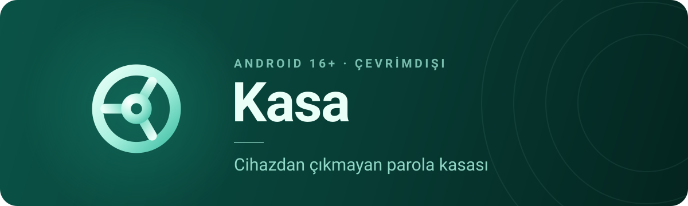
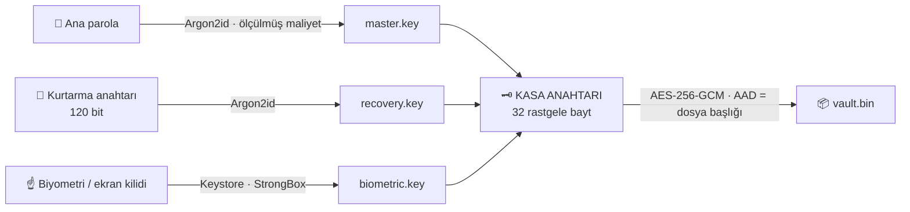

<div align="center">



<br>

**Kotlin · Jetpack Compose · Material 3 Expressive · sunucusuz**

[](#kurulum)
[](#mimari)
[](#tasarım-dili)
[](#sürüm-yayımlama)

[](https://github.com/Erenkng/G-venli-ifre-y-neticisi/actions/workflows/android.yml)

<br>

Parolalarınız **tek bir şifreli dosyada**, yalnızca telefonunuzda durur.<br>
Hesap yok, sunucu yok, eşitleme yok — kaybedilecek bir hesap da yok.

<br>

[**Kurulum**](#kurulum) · [**Güvenlik**](#güvenlik-mimarisi) · [**Özellikler**](#özellikler) · [**Tasarım**](#tasarım-dili) · [**Mimari**](#mimari) · [**Dosya biçimi**](#dosya-biçimleri)

</div>

---

## Bir bakışta

| | |
|:--|:--|
| 🔐 **Tek şifreli dosya** | Kayıt adları, sayısı, kategorileri — hiçbiri diskte açıkta değil. SQLite bunu gizleyemezdi. |
| 🧮 **Cihazda ölçülen Argon2id** | Sabit maliyet, amiral gemisinde gereksiz zayıf ve eski telefonda kullanılamaz yavaştır. Kurulumda ~800 ms'ye ayarlanır. |
| 🧷 **Beş kilit katmanı** | Ana parola, kurtarma anahtarı, biyometri/StrongBox, hızlı PIN, kayıt bazlı ek kilit. |
| 🕳️ **Zorlama parolası** | İkinci bir parola yem kasayı açar; dosyaya bakarak kurulu olup olmadığı anlaşılamaz. |
| ⌨️ **Otomatik doldurma** | Klavye şeridinde satır içi öneri, `assetlinks.json` ile doğrulanmış eşleştirme, 2FA kodunu da doldurma. |
| 🔍 **Güvenlik merkezi** | Sızmış, tekrar kullanılmış, zayıf, eski, 2FA'sız — haftalık arka plan taramasıyla. |
| 📥 **Taşınabilir** | Chrome, Firefox, Bitwarden, 1Password, LastPass CSV içe aktarma; şifreli `.kasa` dışa aktarma. |
| 📴 **İnternet isteğe bağlı** | Tek çevrimiçi uç nokta sızıntı denetimi ve o da k-anonimlik: parola cihazdan çıkmaz. |

> [!IMPORTANT]
> Kasa **yalnızca Android 16 (API 36) ve üstünde** çalışır: `minSdk = targetSdk = compileSdk = 36`.
> Tek hedefe inmenin karşılığı, kod tabanında tek bir `Build.VERSION` dalının bile kalmaması.

---

## Kurulum

```bash
git clone https://github.com/Erenkng/G-venli-ifre-y-neticisi.git
cd G-venli-ifre-y-neticisi

./gradlew assembleDebug     # APK → app/build/outputs/apk/debug/
./gradlew installDebug      # bağlı cihaza kur
./gradlew assembleRelease   # R8 + kaynak küçültmeli sürüm derlemesi
```

Android Studio ile: klasörü aç, Gradle senkronizasyonunu bekle, **Run**.

**Gereksinimler** — JDK 17 · Android SDK 36 · ABI `arm64-v8a` ve `x86_64`
(Argon2Kt 1.6.0'ın 16 KB sayfa hizası ELF program başlıklarından doğrulandı;
32 bit ABI'ler paketlenmiyor).

<details>
<summary><b>Android 17'ye yükseltme, sürekli tümleştirme ve imzalama</b></summary>

<br>

**Android 17.** Yükseltme gerekmez — Android sürümleri geriye dönük uyumludur ve
`targetSdk` yalnızca hangi davranış değişikliklerine katıldığını belirler. API 37
SDK'sı çıktığında `app/build.gradle.kts` içindeki iki sayıyı değiştirmek yeterli,
çünkü kodda başka hiçbir yerde sürüm dalı yok.

**Sürekli tümleştirme.** Depo yazılırken kullanılan ortamda Android SDK indirmesi
engelliydi, bu yüzden derleme doğrulaması GitHub Actions'a taşındı.
`.github/workflows/android.yml` her itmede `assembleDebug`, `assembleRelease` ve
`lintDebug` çalıştırıp APK'yı yapı çıktısı olarak yüklüyor. Derleme
başarısızsa Kotlin hataları günlüğün sonunda ayrıca özetleniyor — Gradle'ın
yığın izi altında kaybolmasınlar diye.

Sürüm derlemesi de **her itmede** sınanıyor, yalnızca etiket atılırken değil. R8
küçültmesi yalnızca orada çalışıyor ve hata ayıklama derlemesinde görünmeyen
kusurları ortaya çıkarıyor: yansımayla erişilen serileştiriciler, passkey
sağlayıcısı, kaynak küçültmesinin kullanılmıyor sandığı çizimler. Bunların ancak
kullanıcıya gidecek APK üretilirken anlaşılması kabul edilebilir değildi.

**İmzalama.** Anahtar deposu depoda değil: imzalama anahtarı uygulamanın kimliği
demek ve onu ele geçiren biri, kullanıcıların güncelleme sanıp kuracağı sahte bir
sürüm yayımlayabilir. Değerler ortam değişkenlerinden okunuyor
(`KASA_KEYSTORE_PATH`, `KASA_KEYSTORE_PASSWORD`, `KASA_KEY_ALIAS`,
`KASA_KEY_PASSWORD`); CI bunları depo gizli anahtarlarından alıyor. Tanımlı
değilse derleme yine başarılı olur ama APK **imzasız** çıkar ve kurulamaz.
Adımlar: [`.github/RELEASE_UNSIGNED.md`](.github/RELEASE_UNSIGNED.md).

</details>

### Sürüm yayımlama

`v` ile başlayan bir etiket itildiğinde `.github/workflows/release.yml` çalışır:
etiketin `versionName` ile aynı olduğunu doğrular, sürüm APK'sını üretir ve GitHub
sürümünü oluşturur.

```bash
git tag v1.1 && git push origin v1.1
```

Etiket itemeyen ortamlar için iş akışı elle de tetiklenebilir
(**Actions → Sürüm → Run workflow**); sürüm adı girdi olarak verilir ve etiketi
iş akışının kendisi oluşturur.

> [!WARNING]
> Etiketle `versionName` uyuşmazsa iş akışı durur. Yanlış sürüm numarası taşıyan
> bir APK'yı geri almanın yolu yoktur; kullanıcının telefonunda o numarayla kurulu kalır.

---

## Güvenlik mimarisi

Kasanın tamamı **tek bir şifreli dosyadır**. Üç ayrı sarmalayıcı aynı kasa
anahtarını farklı yollardan açar; kasa anahtarının kendisi hiçbir zaman
parolalardan türetilmez, rastgeledir.



<details open>
<summary><b>Anahtar türetme ve şifreleme</b></summary>

<br>

| Katman | Seçim | Gerekçe |
|---|---|---|
| Anahtar türetme | **Argon2id**, parametreleri cihazda **ölçülerek** bulunur | Sabit 64 MiB / 3 tur amiral gemisinde gereksiz zayıf, dört yıllık orta segment telefonda kullanılamaz yavaştı. Kurulumda ~800 ms hedefine göre ölçülen değer kasa başlığına yazılır; kasa başka cihaza taşındığında orada yeniden ölçülmez. Yerel kitaplık yüklenemezse PBKDF2-HMAC-SHA512'ye düşer ve bu da başlığa yazılır. |
| Şifreleme paketi | **AES-256-GCM** ya da **XChaCha20-Poly1305**, ölçümle seçilir | AES komut kümesi olan cihazlarda GCM açık ara önde; olmayanlarda ChaCha öne geçiyor ve yazılımda tasarımı gereği sabit zamanlı. Seçim dosya başlığındaki paket kimliğine yazılır, böylece varsayılan değişse bile eski kasa açılmayı sürdürür. |
| Şifreleme | **AES-256-GCM**, 96 bit rastgele nonce | Bütünlük şifrelemenin içinde. Yanlış ana parola ayrı bir doğrulayıcı alan olmadan, etiket hatasıyla anlaşılır — çevrimdışı saldırgana bedava sağlama sunulmaz. |
| AAD | Dosya başlığı (KDF parametreleri dâhil) | Saldırgan Argon2 maliyetini düşürecek şekilde başlığı kurcalayamaz. |
| Kasa anahtarı rotasyonu | Yeni anahtar, kasa baştan şifrelenir, üç sarmalayıcı yeniden yazılır | Ana parola değişimi yalnızca sarmalayıcıyı yeniler; eski anahtarı ele geçirmiş biri eski kopyayı sonsuza dek açardı. Rotasyon önce `.new` dosyaları, sonra işaret dosyası, en son devralma sırasıyla yapılır; yarıda kesilirse açılışta tamamlanır. |
| Bellek | `SecretBytes` (anahtarlar) ve `SecretText` (parolalar) — silinebilir tamponlar | Kasa kilitlendiği anda uygulamanın elindeki hiçbir nesnede okunabilir parola kalmaz. |

</details>

<details>
<summary><b>Kilit katmanları</b> — biyometri, PIN, kayıt bazlı kilit, zorlama parolası</summary>

<br>

| Katman | Seçim | Gerekçe |
|---|---|---|
| Biyometrik kilit | Keystore anahtarı, `setUserAuthenticationRequired(true)`, varsa **StrongBox** | Parmak izi bir bayrağı `true` yapmaz; doğrudan Keystore anahtarının kullanımını açar. Yeni parmak izi kaydedilirse anahtar otomatik geçersizleşir. |
| Hızlı PIN | 4–6 hane; kasa anahtarı önce PIN'den türetilen anahtarla, sonra Keystore anahtarıyla sarmalanır | Dosyayı kopyalayan biri dış katmanı açamadığı için çevrimdışı deneme mümkün değil; cihaz üzerinde beş yanlış denemede PIN düşer ve ana parola istenir. 20 karakterlik ana parolayı günde on kez yazdırmak, pratikte ana parolayı zayıflatan kuraldır. |
| Cihaz kimlik bilgisi | İsteğe bağlı: biyometri **ya da** telefonun ekran kilidi | Parmak izi okuyucusu bozuk cihazda tek seçenek "her açılışta ana parola" olmasın diye. Eşiği bilerek düşürüyor, bu yüzden varsayılan değil. |
| Kayıt bazlı ek kilit | İşaretli kayıtta alanlar doğrulama gelene kadar **hiç çizilmez** | Banka kaydının Spotify kaydıyla aynı eşiği paylaşması için sebep yok. Maskeleyip "göster"e basılabilir bırakmak, korunanı bir dokunuş uzağa koymak olurdu. |
| Zorlama parolası | İkinci bir ana parola yem kasayı açar; iki bölme aynı dosyada | Kurulu olup olmadığı dosyaya bakılarak anlaşılamaz: sarmalayıcı her kasada aynı boyutta, yem bölmesi her kasada dolu ve bölmeler 4 KiB'lik bloklara tamamlanıyor. İki sarmalayıcı eş zamanlı denenir; sırayla denemek yem parolanın iki kat uzun sürmesi demekti. |
| Bağlama duyarlı kilit | Güvenilen Wi-Fi'da daha uzun kilit gecikmesi | Ağ adı ham hâlde saklanmaz; yalnızca `SHA-256(ssid‖bssid)` özetinin ilk 16 baytı, yalnızca cihazda. Konum izni gerektirdiği için tamamen isteğe bağlı ve izin yoksa sessizce devre dışı. |
| Deneme sayacı | Cihaz anahtarıyla şifreli, üstel bekleme (5 sn → 30 dk) | İsteğe bağlı olarak N hatalı denemeden sonra kasayı kalıcı siler. |
| Otomatik kilit | Ekran kapanınca **hemen**, arka planda süreyle | Kilitlendiğinde anahtar bellekten silinir, pano temizlenir. |

</details>

<details>
<summary><b>Cihaz ve ağ yüzeyi</b> — ekran, pano, yedekleme, sızıntı denetimi</summary>

<br>

| Katman | Seçim | Gerekçe |
|---|---|---|
| Passkey | FIDO2/WebAuthn kimlik bilgileri kasada; Kasa bir Credential Manager sağlayıcısı | Özel anahtar Keystore'da değil kasada: Keystore'a bağlı bir passkey telefonla birlikte kaybolurdu ve parola yöneticisinin varlık sebebi tam olarak bunu engellemek. `none` attestation, AAGUID sıfır — yazılım kimlik doğrulayıcısı kendisi hakkında doğrulanabilir bir şey söyleyemez; sahte bir donanım kimliği üretmek yerine hiçbir şey iddia etmiyoruz. |
| Yedekleme | `allowBackup=false`, buluta ve cihaz aktarımına kapalı | Taşınan bir kopya zaten açılamaz; yalnızca saldırı yüzeyi büyütürdü. |
| Ağ | Tek uç nokta, sistem CA'ları, düz metin HTTP yasak | Kullanıcı tarafından kurulan sertifikalar (araya girme vekilleri) güvenilmez. |
| Sızıntı denetimi | HIBP **k-anonimlik**: yalnızca SHA-1 özetinin ilk 5 hanesi | Parolanın kendisi asla cihazdan çıkmaz. `Add-Padding` ile yanıt uzunluğu da gizlenir. |
| Ekran | `FLAG_SECURE` (varsayılan açık) | Ekran görüntüsü, son uygulamalar önizlemesi ve ekran yansıtma kapalı. |
| Pano | Hassas işaretleme + alarmla otomatik temizleme | Android 13+ pano önizlemesinde içeriği gizler; süre dolunca uygulama öldürülmüş olsa bile alarm panoyu siler. |
| Otomatik doldurma | Kilitliyse doldurma **yok** | "Kolaylık olsun diye kasayı açık tutalım" tuzağına düşmez; önce kimlik doğrulama akışı çalışır. |
| Araç birimi | Gizli veri göstermez | Ana ekran araç birimleri kilit ekranında görünebilir; oraya kod basmak otomatik kilidi anlamsız kılardı. |
| Bildirimler | `VISIBILITY_SECRET` | Hangi hesabın sızdığı da gizli bir bilgidir. |
| Sürüm derlemesi | R8 tam kip + tüm `Log` çağrıları çıkarılır, `dependenciesInfo` kapalı | Üretimde kayıt sızıntısı ve APK meta verisi yok. |

</details>

<details>
<summary><b>Güvenlik denetiminde bulunup düzeltilenler</b> — 15 gerçek kusur</summary>

<br>

Kod baştan sona düşman gözüyle okundu. Bulunan gerçek kusurlar:

| Bulgu | Neden önemliydi |
|---|---|
| Otomatik doldurmada ad benzerliğiyle eşleşme | `packageName` son parçası kayıt adıyla karşılaştırılıyordu: `com.kötü.garanti` adlı bir uygulama yayımlayan biri "Garanti" kaydının parolasını isteyebilirdi. Yerine üç **doğrulanmış** güven katmanı geldi: kullanıcının elle bağladığı uygulama, `assetlinks.json` ile doğrulanan alan adı, tanınan tarayıcıda alan adı eşleşmesi. |
| `webDomain` her uygulamadan kabul ediliyordu | Bu alanı uygulamanın kendisi doldurur, sistem doğrulamaz. Kötü niyetli bir uygulama kendi formuna `webDomain="bankam.com"` yazıp o bankanın parolasını isteyebilirdi ve kullanıcı doğru kaydı gördüğü için dokunurdu. Artık yalnızca tanınan tarayıcılardan kabul ediliyor. |
| Eşleşme yokken kasadan beş kayıt öneriliyordu | Parola alanı olan **herhangi** bir uygulama, hiçbir eşleşme sağlamadan kullanıcının hesaplarını öneri menüsünde görebiliyordu. Artık tek bir kimlik doğrulamalı "Kasa'dan seç" satırı dönüyor. |
| Kilit açmada iki Argon2 eş zamanlıydı | İki türetme aynı anda bellekteydi; ölçüm 512 MiB'ye çıkabildiği için orta segment telefonda çökme riski. Sırayla çalışıyor, ikisi de her zaman yapılıyor (süre sabit kalsın diye). |
| Zorlama parolası ana parolayla aynı olabiliyordu | Aynı parola her ikisini de açtığında önce ana sarmalayıcı denendiği için kullanıcı yem kasa açtığını sanarken gerçek kasasını açardı. Kurulumda denetleniyor. |
| XChaCha20 el yazması ve denetlenmemişti | Sessizce yanlış bir alt anahtar, açılamayan bir kasa demek; ancak kullanıcı doğru parolayla açamadığında anlaşılır. Artık RFC vektörü ve gidiş-dönüş testi geçmeden paket sunulmuyor. |
| HIBP yanıtında sonek kısmen karşılaştırılıyordu | Kısa bir satır, kendi ön ekiyle başlayan her parolayı "sızmış" gösterebilirdi. Uzunluk eşitliği zorunlu. |
| Deneme sayacı bozulunca sıfır sayılıyordu | Üstel beklemeyi tek dosya bozarak atlamanın yolu. Artık kurcalanmış sayılıp bekleme uygulanıyor. |
| `writeAtomically` dizini `fsync` etmiyordu | Elektrik kesintisi, içeriği yazılmış ama adı hâlâ `.tmp` olan bir dosya bırakabilirdi — kasa kaybolmuş görünürdü. |
| Sıfır baytlık ek yazılıp okunamıyordu | Boş bir mühür tam olarak nonce + etiket uzunluğunda; kesin büyüklük aranıyordu. |
| Parola üreteci dağılımı düzgün değildi | İlk konumlara her kümeden birer karakter konuyordu; bildirilen entropi gerçekte olduğundan yüksekti. Reddetme örneklemeye geçildi. |
| TOTP anahtarı ve kurtarma anahtarı bellekte kalıyordu | İkisi de parola kadar değerli. Çözülen baytlar artık her yolda sıfırlanıyor. |
| `"pass"` anahtar sözcüğü çok genişti | "passport", "passenger", "compass" alanlarını parola sanıp oraya parola yazdırıyordu. |
| Dışa aktarma sabit maliyet kullanıyordu | Dosya cihazdan çıkıyor ve tek koruması parolası; artık ayrı ve daha ağır ölçülüyor (~2 sn), parola alt sınırı 12 karakter. |
| `rootPackagesPresent` hiç çalışmıyordu | Paket görünürlüğü kısıtı yüzünden her zaman `false` dönerdi. Çalışmayan güvenlik kodu, hiç olmamasından kötüdür: kapsam varmış gibi görünür. Kaldırıldı. |

</details>

### Açıkça söylenen sınırlar

> [!CAUTION]
> Bir güvenlik iddiası, sınırı söylenmediği sürece eksiktir.

- **Deneme sayacı silinebilir.** Root yetkisi olan biri `attempts.bin`'i siler ve
  üstel beklemeyi sıfırlar; Android'de uygulamanın kendi veri dizinindeki bir
  dosyayı bundan koruma yolu yok. Kararlı saldırgana karşı asıl koruma sayaç
  değil: ana parolanın **en az 60 bit** olma zorunluluğu ve ölçümle ~800 ms'ye
  ayarlanmış Argon2id maliyeti.
- **Zorlama parolası "ikinci parolayı da ver" diyene karşı çalışmaz.** Verdiği tek
  söz dar ve gerçek: *dosyaya bakarak kurulu olup olmadığı anlaşılamaz.*
- **Kayıt bazlı ek kilit bir varlık kontrolüdür**, kripto bağlı değil. Kasa
  anahtarı zaten bellekte; sorulan şey erişim değil, telefonu o anda kimin
  tuttuğu. Uygulamanın belleğine müdahale edebilen bir saldırgan onu atlar — ama
  o saldırgan kasa anahtarına zaten erişmiştir.
- **Bellekte `String` tamamen ortadan kaldırılamaz.** JSON çözücüsü ve Compose
  metin alanı kaçınılmaz olarak `String` üretir. Verilen söz "hiç `String`
  olmasın" değil, **kalıcı kopya olmasın**.
- **Root tespiti bir güvenlik sınırı değildir.** Uygulama bir kez uyarır, kapanmaz.
  Kararlı bir saldırgan tespiti atlatır; amaç kullanıcıyı bilgilendirmek.
- **Tarayıcı listesi eksik kalabilir.** Tanınmayan bir tarayıcıda alan adı
  eşleşmesi çalışmaz ve kullanıcı kaydı elle seçer. Kimlik avına açık kalmaktansa
  bu bedel tercih edildi.
- **Güvenli silme flash bellekte tam garanti değildir.** Dosyanın üzerine rastgele
  veri yazılır ama asıl güvence, dosyanın zaten şifreli olması ve anahtarının
  Keystore'dan silinmesidir.
- **Bulut eşitleme yok** ve bilinçli olarak yapılmadı. Sunucu tarafı, anahtar
  yönetimi ve hesap kurtarma akışı olmadan eşitleme, güvenliği düşüren bir
  özelliktir. Taşıma için şifreli `.kasa` dosyası dışa/içe aktarımı var.

---

## Özellikler

<table>
<tr>
<td width="50%" valign="top">

### 🗂️ Kasa

- **Dokuz kayıt türü** — giriş, kart, güvenli not, 2FA, kimlik, banka hesabı,
  SSH/API anahtarı, yazılım lisansı, Wi-Fi ağı. Yeni türler `CategorySchema`
  içinde **veri olarak** tanımlı, arayüz kodu gerektirmiyor
- Klasörler ve kurala göre kendini dolduran koleksiyonlar
- **Çöp kutusu kendi ekranında**; 30 gün sonra kendiliğinden siliniyor
- Kayıt başına şifreli ek dosyaları (her ek kendi anahtarıyla, ayrı dosyada)
- Parola geçmişi (son 10), özel alanlar, etiketler, silmeyi geri alma
- **Basılı tutunca** hızlı bakış, kopyala, çoğalt, çöpe at
- **Parola yenileme hatırlatıcısı**: kayıt başına gün sayısı

</td>
<td width="50%" valign="top">

### 🎲 Üretici

- Parola, **söylenebilir** parola ve Türkçe sözcük dizisi
  (517 ASCII sözcük, sözcük başına ~9 bit)
- 8–64 karakter; büyük harf / rakam / sembol / karışan harfleri ele
- Gerçek entropi hesabı ve çevrimdışı kırma süresi tahmini
- `SecureRandom` + modulo sapması olmayan **reddetme örneklemesi**

### 🛡️ Güvenlik merkezi

- Kasa puanı: ortalama güç eksi yapısal cezalar
  (sızıntı > tekrar > zayıflık > yaş > 2FA eksikliği)
- **Kasa özeti**: kayıt sayısı, 2FA oranı, ortalama uzunluk, en eski parola
- Haftalık arka plan taraması ve bildirim (yalnızca kasa açıkken)

</td>
</tr>
<tr>
<td width="50%" valign="top">

### 📱 Telefon

- Biyometrik kilit (Class 3), Keystore + StrongBox
- **Otomatik doldurma**: klavye şeridinde satır içi öneri, `assetlinks.json`
  doğrulaması, 2FA kodunu doldurma, "güncelle mi yeni kayıt mı" ayrımı
- Kamera ile 2FA karekod okuma (ZXing, çevrimdışı)
- **Wi-Fi kaydından karekod**: misafir parolayı hiç görmeden bağlanır
- Son kullanılan kayıtlar için **başlatıcı kısayolları**
- Hızlı ayarlar döşemesi, ana ekran araç birimi
- Dokunsal geri bildirim desenleri, kenardan kenara düzen, tahminli geri
- Türkçe/İngilizce, uygulama içi dil yapılandırması

</td>
<td width="50%" valign="top">

### 📥 Taşıma

- **CSV içe aktarma**: Chrome, Firefox, Bitwarden, 1Password, LastPass
  — başlık satırından biçim kendiliğinden tanınıyor
- Elde yazılmış **RFC 4180** ayrıştırıcısı: tırnaklı alan, alan içinde
  çift tırnak ve satır sonu. `split(",")` içinde virgül geçen her parolayı
  bozardı ve bu ancak o hesaba girilmeye çalışılınca anlaşılırdı
- `otpauth://` adresinden 2FA anahtarını çıkarma
- Şifreli `.kasa` dışa/içe aktarımı (ayrı ve daha ağır KDF)

</td>
</tr>
</table>

---

## Tasarım dili

<details open>
<summary><b>Açılış işareti</b></summary>

<br>

Uygulama, sistemin kendi açılış ekranıyla açılıyor (`Theme.Kasa.Splash`). Simge
duran bir resim değil: önce kadranın çemberi kendini çiziyor, sonra kadran ters
yönden dönüp yerine oturuyor — bir kasa açılırken kadranın çevrilmesi. Toplam
780 ms. `minSdk` 36 olduğu için platformun API 31 açılış ekranı her cihazda var;
core-splashscreen uyumluluk kitaplığı eklenmedi.

Çıkış da elle yazıldı. Sistemin varsayılanı işareti olduğu yerde bırakıp pencereyi
karartıyor: kadran dönüşünü yeni bitirmişken bir an duruyor ve açılış bittiği
yerde kesiliyor. Burada işaret kullanıcıya doğru büyüyerek çözülüyor, altındaki
uygulama zaten çizilmiş durumda. Ardından parola alanı **anında belirmiyor**:
bulanıklıktan ve dağılan noktalardan toplanıyor.

</details>

<details>
<summary><b>Hareket sözlüğü</b> — tek kaynaktan gelen beş belirteç</summary>

<br>

Bütün animasyonlar `ui/theme/Motion.kt` içindeki tek bir sözlükten geliyor.
Öncesinde beş ayrı sönümleme oranı ve altı ayrı süre vardı; her biri yazıldığı
anda o ekrana iyi gelen bir sayıydı ve hiçbiri ötekine bakılarak seçilmemişti.

Ayrım **alınan yola** göre yapılıyor. Yaylı bir animasyonun algılanan süresi
yalnızca sertliğe bağlı, yola değil; aynı sertlik uzun bir yolda kırbaç gibi,
kısa bir yolda uyuşuk görünür. Mesafeye göre ayırınca ekrandaki her hareket
kabaca aynı hızda oluyor ve göz bunu tek bir sistem olarak okuyor.

| Belirteç | Yol | Nerede |
|---|---|---|
| `small` | ~40dp altı | basış durumu, köşe yarıçapı, anahtar başlığı |
| `medium` | bileşen boyu | gezinti göstergesi, eylem menüsü, satır yer değişimi |
| `large` | ekran boyu | sekme geçişi, alt sayfa, güç kadranı |
| `effect` | hareket yok | saydamlık, renk — aşma olmaz, yoksa titrer |
| `stagger` | sıralı | eylem menüsünün öğeleri, 26 ms aralıkla |

Giriş 240 ms, çıkış 160 ms: gelen yüzey dikkati üstüne çeker, gidenin oyalanmaya
hakkı yoktur. Sekmeler arası geçiş yönlü — gezinti çubuğunda sağa gidildiğinde
içerik de sağdan gelir; dört sekmenin sırası zihinde bir şerit olarak kalıyor.

Sistemde animasyonlar kapalıysa (`ANIMATOR_DURATION_SCALE = 0`) sözlüğün tamamı
anlık geçişe düşüyor; bu tek bir `CompositionLocal` üzerinden aşağıya iniyor.

</details>

<details>
<summary><b>Kademeli bulanıklık</b> — neden tek yarıçap yetmedi</summary>

<br>

Gezinti çubuğu içeriğin üzerinde duruyor ve altındaki içerik kademeli
bulanıklaşıyor: iki farklı yarıçapta geçiş iç içe geçiyor.

Tek yarıçapı saydamlıkla söndürmek yetmiyordu — yarı saydam bir noktada net
içerik ve bulanık kopyası üst üste duruyor, göz bunu yumuşak geçiş olarak değil
**hayalet bir çift görüntü** olarak okuyor. Buzlu camın gerçekte değiştirdiği şey
saydamlığı değil kalınlığı.

Bulanıklık için ekran içeriği bir katmana kaydediliyor; kayıt bedava olmadığı için
artık yalnızca bulanıklık gerçekten çizilecekse yapılıyor.

</details>

<details>
<summary><b>Görünüm</b></summary>

<br>

- Açık ve karanlık tema, sistem takibi, AMOLED tam siyah
- Material You dinamik renk — güç renkleri sabit kalır (zayıf her zaman kırmızı)
- Roboto Flex değişken yazı tipi (wght/wdth/GRAD eksenleri)
- İmza hareketleri: güce göre biçim değiştiren kadran, dalgalı ilerleme
  çubukları, basınca sıkışan liste satırları, komşusuna tepki veren düğme grubu
- **Yalnızca dikey.** Yatay modda içerik alanı yarıya iniyor ve bir parola
  yöneticisinde okunacak şey zaten uzun bir liste; iki ayrı düzeni doğru tutmanın
  bedeli, kazandırdığından büyüktü

</details>

<details>
<summary><b>Kare bütçesi</b> — 60 ve 120 Hz için yapılanlar</summary>

<br>

| Kaynak | Yapılan |
|---|---|
| Kararsız model sınıfları | Hiçbir veri sınıfında kararlılık işareti yoktu; `List` bir arayüz olduğu için `VaultItem`, `VaultData`, `Folder` ve `Settings` kararsız sayılıyordu. Tek bir kaydın değişmesi ekrandaki **bütün** satırların yeniden bestelenmesine yol açıyordu. `@Immutable` eklendi ve söz tutuluyor: her değişiklik `copy()` ile yeni nesne üretiyor. |
| İlk açılışta JIT ısınması | `src/main/baseline-prof.txt` açılış ve ilk kaydırma yollarını kurulumda önceden derletiyor. |
| Kare başına ayırma | `buildMorphPath` her çağrıda yeni bir `Path` ve kutulanmış `Offset` dizisi ayırıyordu; kadran kare başına dört kez çiziliyor. Yol ve köşe tamponu bir kez kurulup yeniden kullanılıyor. "En zayıf önce" sıralaması güç ölçümünü karşılaştırıcının içinde yapıyordu (500 kayıtta ~4500 ölçüm); ölçüm artık kayıt başına bir kez. |
| Gereksiz katman kaydı | Bulanıklık için ekran her karede tam boyutlu bir katmana kaydediliyordu; artık yalnızca gerektiğinde. |
| Liste besteleri | Kaydırılan listelere `contentType` eklendi: Compose satır bestesini yeniden kurmak yerine yeniden kullanıyor. |

> [!NOTE]
> Bu değişikliklerin hepsi Compose'un belgelenmiş davranışına dayanıyor ama
> **gerçek kare süreleri bir cihazda ölçülmedi** — bu depoda cihaz erişimi yok.
> Aynı şekilde temel profil elle yazıldı; ölçülmüş bir profil daha küçük ve daha
> isabetli olurdu.

</details>

---

## Mimari

```
app/src/main/java/app/kasa/
├── core/
│   ├── crypto/      Crypto, Kdf, AeadSuite, KeystoreKeys, SecretBytes, Base32
│   ├── security/    AutoLocker, SecureClipboard, DeviceIntegrity
│   └── util/        Totp, PasswordStrength, PasswordGenerator, WifiQr, Haptics
├── data/
│   ├── VaultStore     dosya biçimi, sarmalayıcılar, dışa/içe aktarma
│   ├── CsvImport      RFC 4180 ayrıştırıcısı + biçim tanıma
│   ├── SettingsStore  DataStore tercihleri (gizli veri yok)
│   ├── model/         VaultItem, VaultData, CategorySchema
│   ├── net/           BreachChecker (HIBP k-anonimlik)
│   └── repo/          VaultRepository (tek doğruluk kaynağı), SecurityAnalyzer
├── ui/
│   ├── theme/       renkler, Roboto Flex tipografi, şekiller, hareket sözlüğü
│   ├── components/  tasarımdan birebir bileşenler
│   ├── screens/     kasa, üret, güvenlik, ayarlar, kurulum, kilit, çöp, düzenleyici
│   └── *ViewModel   ekran durumları
├── autofill/        servis, yapı ayrıştırıcı, alan adı doğrulama, eşleştirici
├── widget/          ana ekran araç birimi
├── tile/            hızlı ayarlar döşemesi
└── work/            haftalık güvenlik taraması
```

Bağımlılık enjeksiyonu için Hilt yerine elle kurulan `AppContainer` kullanılıyor:
bu boyutta bir uygulamada ek açıklama işleyicisi derleme süresini ikiye katlar ve
kasa anahtarını tutan deponun ömrünü **tek bir yerde** görebilmek güvenlik
açısından daha değerli.

---

## Dosya biçimleri

| Dosya | İçerik |
|---|---|
| `kasa/vault.bin` | `KASAVLT1` + AES-GCM(kasa JSON'u) |
| `kasa/master.key` | `KASAMST1` + KDF parametreleri + AES-GCM(kasa anahtarı) |
| `kasa/recovery.key` | `KASAREC1` + KDF parametreleri + AES-GCM(kasa anahtarı) |
| `kasa/biometric.key` | `KASABIO1` + IV + Keystore-GCM(kasa anahtarı) |
| `kasa/att/<id>.bin` | `KASAATT1` + AES-GCM(ek dosyası), eke özel anahtarla |
| `kasa/attempts.bin` | Cihaz anahtarıyla şifreli deneme sayacı |
| Dışa aktarma `.kasa` | `KASAEXP1` + Argon2id(128 MiB) + AES-GCM — ayrı dışa aktarma parolasıyla |

Ana parola değiştiğinde kasa yeniden şifrelenmez; yalnızca sarmalayıcı yenilenir.
Bu hem hızlıdır hem de değişiklik sırasında veri kaybı penceresi bırakmaz.

### Şema göçü

Kasa JSON'u bir `schema` sürümü taşır ve `VaultMigrations` adım adım yükseltir.
İki yön de kapalı:

- **Eski dosya, yeni uygulama** → zincir sırayla çalışır.
- **Yeni dosya, eski uygulama** → açılmayı **reddeder**. Bu ikincisi daha önemli:
  `ignoreUnknownKeys` açık olduğu için eski sürüm yeni alanları tanımaz, okur gibi
  yapar ve ilk kaydetmede kalıcı olarak siler.

> [!NOTE]
> Aynı gerekçeyle, kasa **herhangi bir nedenle** okunamıyorsa kilit hiç açılmaz.
> Boş bir kasayla açılıp ilk yazmada gerçek kayıtların üstüne binmek, okuma
> hatasının verebileceği en pahalı sonuçtu.

<div align="center">
<br>

`kasasifreyoneticisi.html` tasarımının çalışan Android uygulaması.

</div>
